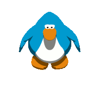
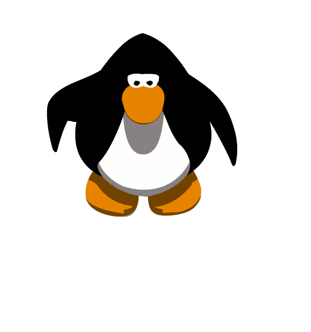

  
  <h1>Hey, how you doin'✌️</h1>

<h3 align="center">I'm Peter, a full stack developer with a BSc CompSci from the University of Alberta.</h3>

  ( ˘▽˘)っ <a href="https://peterplatypus.github.io" target="_blank" rel="noopener noreferrer">My Portfolio</a> (´ε｀ )♡

 

👉 Collaborated in a 7-member team to develop and deploy a business website for Zero RampUp using React.

👉 Worked as a backend developer to create a social network platform app using Django that linked with other teams' APIs.

👉 Automated a moderate codebase with automatic deployment, testing, and reporting purely through GitHub actions.

👉 Can bake a mean banana bread (according to my mom).

🧑‍💻 Experience in...
  -	Languages: Python, C/C++/C#, Java, JavaScript, SQL, HTML/CSS, XML.
  -	Technologies: React, Django, Android, Git, JUnit, Docker, Pandas, Linux.
  -	Databases: MongoDB, PostgreSQL.

🌱 I’m currently learning more HTML and CSS tricks for cool websites!

⚡ Fun fact: I want to be a polyglot! Currently studying Japanese （今とても下手けど、上手になりたいんだよ）, fluent in Mandarin and English.

📫 How to reach me: **sqiu@ualberta.ca**
  

  <h1>Check out some of my projects below👇</h1>
  

<!--
**riceboypeter/riceboypeter** is a ✨ _special_ ✨ repository because its `README.md` (this file) appears on your GitHub profile.

Here are some ideas to get you started:

- 🔭 I’m currently working on ...
- 🌱 I’m currently learning more web design!
- 👯 I’m looking to collaborate on ...
- 🤔 I’m looking for help with ...
- 💬 Ask me about ...
- 📫 How to reach me: ...
- 😄 Pronouns: ...
- ⚡ Fun fact: I want to be a polyglot! Currently studying Japanese, fluent in Mandarin and English
-->
